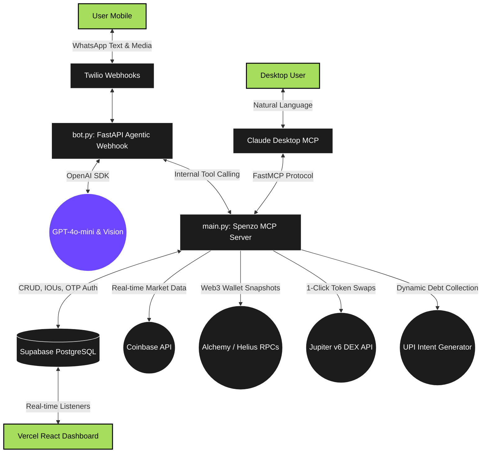

# Spenzo : The Omni-Chain Financial Superpower


[](https://www.python.org/downloads/release/python-3110/)
[](https://fastapi.tiangolo.com/)
[](https://modelcontextprotocol.io/)
[](https://supabase.com/)

**Spenzo** is an advanced, Omni-Chain Financial Superpower. It doesn't just track your fiat expenses: it operates as a consolidated NLP layer to manage your wealth. Monitor live Web3 portfolios, simulate advanced DEX routing quotes, and extract invoice metadata entirely through programmatic chat integrations natively inside WhatsApp and Claude Desktop.

**Website:** [spenzo.xyz](https://www.spenzo.xyz)  
**Detailed Documentation:** [FEATURES.md](FEATURES.md)

---

## Features

- **WhatsApp Native:** Text your expenses naturally ("Spent ₹150 on chai"). Spenzo auto-categorizes and logs them instantly.
- **Receipt Vision:** Snap a photo of a bill or receipt on WhatsApp. Spenzo extracts the merchant, total, and date automatically using GPT-4o.
- **Smart Bill Splitting:** "Dinner was 3000 but we split it 3 ways." Spenzo handles the math and logs your exact share.
- **Live Crypto Prices:** Built-in real-time CoinGecko integration. Ask "What's the price of SOL?" to log crypto purchases accurately.
- **Claude Desktop Integration:** Use Spenzo as a native MCP (Model Context Protocol) tool inside Claude for hands-free financial management.
- **Real-time Dashboard:** View beautiful, mobile-optimized spending charts, category donuts, and transaction histories.
- **Cross-Platform Sync:** Securely link your WhatsApp number to your desktop session via OTP so all your financial data is unified.

---

## Architecture

Spenzo uses a modern, serverless-friendly microservice architecture:



---

## QuickStart Guide

### 1. Try the WhatsApp Bot

1. Message **`+1 (415) 523-8886`** on WhatsApp.
2. Send the exact phrase `join conversation-heading` to enter the secure Twilio sandbox.
3. Say "Hi" to see what Spenzo can do!
4. Check your personal data at [spenzo.xyz/analytics](https://www.spenzo.xyz/analytics).

> **Note:** The backend sleeps on Render's free tier. Your very first message might take ~45 seconds while the server wakes up. Consecutive messages are instant.

### 2. Connect to Claude Desktop (3 Options)

Since Spenzo is an MCP Server, it must attach to a client like Claude Desktop. Choose the right method for you:

#### 1. Download the App for Mac/Windows (No Coding Required)
You can distribute Spenzo as a single, zero-dependency executable. No source code or environment setup required.
1. Download the compiled `spenzo-mac` or `spenzo-win.exe` binary:
   👉 **[Download Spenzo Binaries (Google Drive)](https://drive.google.com/drive/folders/1hJIwEehKF4R0T--kcmxNspcS11a5qXkg?usp=share_link)**
2. Edit your `claude_desktop_config.json`:
   ```json
   "mcpServers": {
     "spenzo": {
       "command": "/Users/YOUR_NAME/Desktop/spenzo-mac", // or spenzo-win.exe
       "env": { "SUPABASE_URL": "...", "OPENAI_API_KEY": "..." }
     }
   }
   ```

#### 2. Cloud API (Zero Local Compute)
Spenzo's `main.py` detects cloud environments automatically and starts a Server-Sent Events (SSE) listener. 
1. Run Spenzo on Render/AWS.
2. Download the tiny `sse_relay.py` connection script to your Desktop.
3. Edit your `claude_desktop_config.json`:
   ```json
   "mcpServers": {
     "spenzo-cloud": {
       "command": "python",
       "args": ["/Users/YOUR_NAME/Desktop/sse_relay.py", "https://YOUR-RENDER-URL.onrender.com/sse"]
     }
   }
   ```

#### 3. From Source (For Developers)

**Prerequisites:** Python 3.11+ and the [`uv`](https://github.com/astral-sh/uv) package manager.

1. **Clone & Install:**
   ```bash
   git clone https://github.com/Arav-Arun/Spenzo.git
   cd Spenzo
   uv sync
   ```
2. **Environment Variables:**
   Create a `.env` file in the root directory:
   ```env
   SUPABASE_URL="https://your-project.supabase.co"
   SUPABASE_KEY="your-service-role-key"
   OPENAI_API_KEY="sk-..."
   TWILIO_ACCOUNT_SID="ACxxx..."
   TWILIO_AUTH_TOKEN="your-auth-token"
   TWILIO_WHATSAPP_NUMBER="whatsapp:+14155238886"
   ALCHEMY_API_KEY="your-alchemy-key"
   HELIUS_API_KEY="your-helius-key"
   ```
3. **Link to Claude Desktop:**
   Open your Claude Desktop config file and add:
   ```json
   {
     "mcpServers": {
       "spenzo": {
         "command": "uv",
         "args": ["run", "fastmcp", "run", "/ABSOLUTE/PATH/TO/Spenzo/main.py"]
       }
     }
   }
   ```
   Restart Claude, and you can now ask Claude to manage your expenses!

---

## Available MCP Tools

Developers can utilize the following database tools via `main.py`:

| Tool                              | Description                                                    |
| --------------------------------- | -------------------------------------------------------------- |
| `add_expense`                     | Log a new expense (date, amount, category, subcategory, note). |
| `list_expenses`                   | Fetch chronological expense entries within a date range.       |
| `summarize`                       | Generate category-based spending totals for KPI dashboards.    |
| `search_expenses`                 | Keyword search across all categories, subcategories, or notes. |
| `edit_expense` / `delete_expense` | Modify or remove specific transaction rows securely.           |
| `get_crypto_price`                | Fetch live USD/INR prices for seamless crypto logging.         |
| `register_phone` / `verify_phone` | Issue and verify Twilio OTPs to securely bridge platforms.     |

---

## The Web3 Edge (Advanced MCP Tools)

Spenzo seamlessly acts as a Bloomberg Terminal for personal crypto wallets, pulling live data from **Alchemy** (Ethereum) and **Helius** (Solana) RPCs.

Whenever you provide a public Web3 wallet (`0x...` or `base58`), Spenzo exposes 4 powerful analytical tools:

| Web3 Tool             | Capabilities                                                                 |
| --------------------- | ---------------------------------------------------------------------------- |
| `analyze_web3_wallet` | Scans an ETH/SOL wallet to pull real-time token balances and fiat Net Worth. |
| `simulate_dex_swap`   | Hits DEX aggregators (Jupiter/Uniswap) to quote trades and slippage.         |
| `analyze_gas_burn`    | Sweeps strictly on-chain transactions via Helius/Etherscan to compute real gas fees. |
| `check_staking_yield` | Scans for LST balances (stETH, JitoSOL) and native validator staking rewards. |

---

Spenzo securely transitions from a read-only intelligence layer to an active Execution tool. By dynamically constructing deep-link payloads, Spenzo handles complex routing and computation in the background, then hands you a 1-click confirmation prompt without ever requesting access to your private keys or banking credentials.

| Execution Tool              | Action & Routing Mechanism                                                                |
| --------------------------- | ----------------------------------------------------------------------------------------- |
| `simulate_dex_swap`         | Hits Jupiter v6 Quote API to format exact _1-Click Transaction Execution_ links.          |
| `generate_upi_payment_link` | Constructs `upi://pay` intent payloads and dynamic QR codes for 1-click fiat drops.       |
| `log_debt` / `list_debts`   | Serves as an isolated IOU ledger, natively returning auto-generated UPI collection links. |
